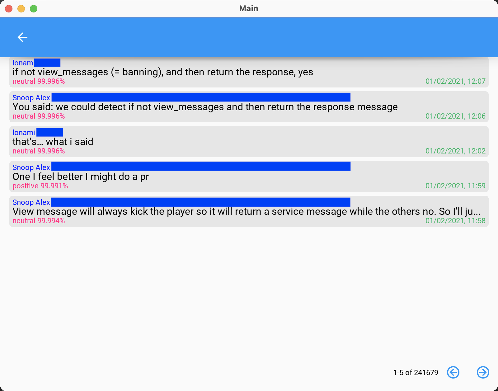

TeleML is a Telegram client allowing users to perform sentiment analysis of posts that appear in chats. The experimental application does not feature all the functionalities of the Telegram original client, but just those that are necessary to perform sentiment analysis on a chat, for example sign-in, iterate over dialogs, and choose a particular discussion

